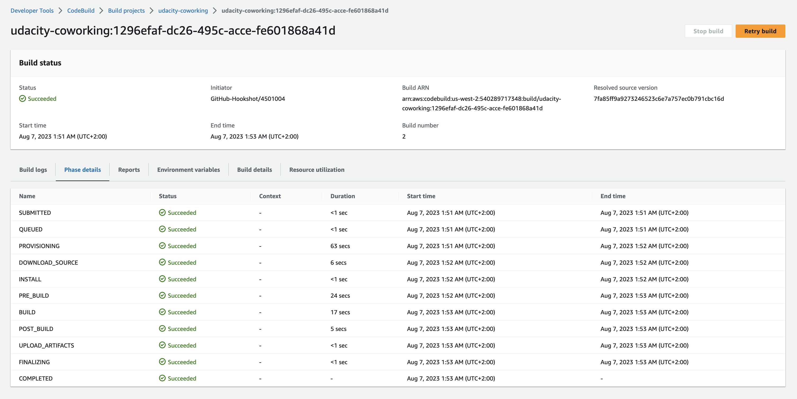
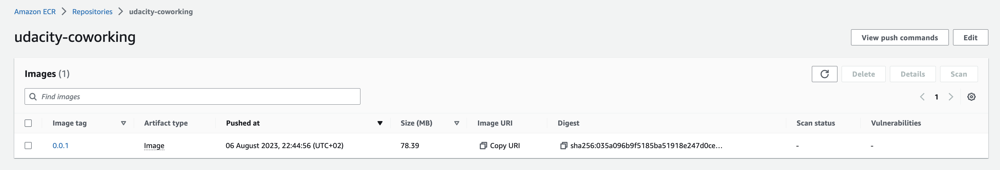
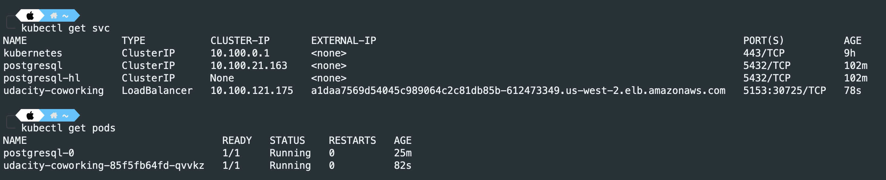
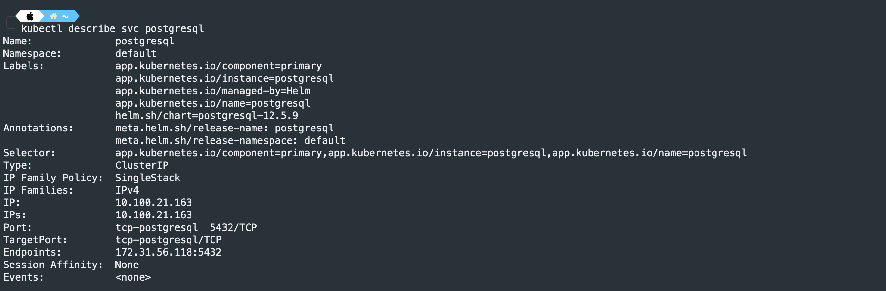
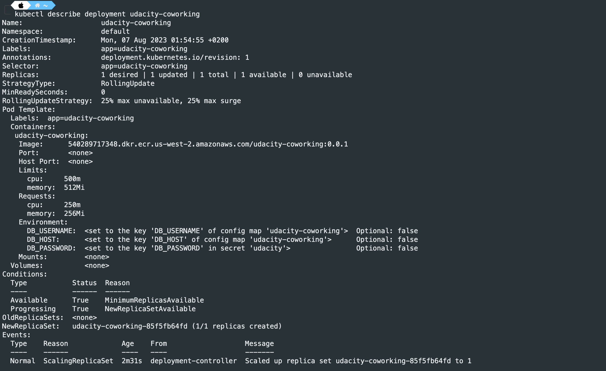
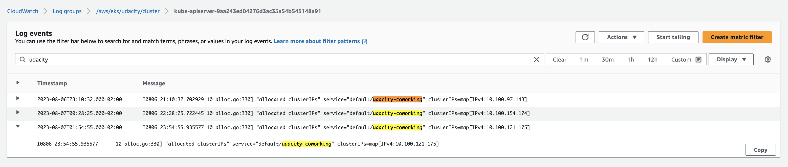

# udacity-coworking-microservice

## Project: Coworking Space Service

The Coworking Space Service is a set of APIs that enables users to request one-time 
tokens and administrators to authorize access to a coworking space.

This service follows a microservice pattern and the APIs are split into distinct 
services that can be deployed and managed independently of one another.

For this project, you are a DevOps engineer who will be collaborating with a team that 
is building an API for business analysts. The API provides business analysts with basic 
analytics data on user activity in the coworking space service. The application they 
provide you functions as expected, and you will help build a pipeline to deploy it to Kubernetes.

## Project Instructions

1. Set up a Postgres database with a Helm Chart.

2. Create a Dockerfile for the Python application.
    - You'll submit the Dockerfile

3. Write a simple build pipeline with AWS CodeBuild to build and push a Docker image into AWS ECR.
    - Take a screenshot of AWS CodeBuild pipeline for your project submission.
    - Take a screenshot of AWS ECR repository for the application's repository.

4. Create a service and deployment using Kubernetes configuration files to deploy the application.

5. You'll submit all the Kubernetes config files used for deployment (ie YAML files).
    - Take a screenshot of running the kubectl get svc command.
    - Take a screenshot of kubectl get pods.
    - Take a screenshot of kubectl describe svc <DATABASE_SERVICE_NAME>.
    - Take a screenshot of kubectl describe deployment <SERVICE_NAME>.

6. Check AWS CloudWatch for application logs.
    - Take a screenshot of AWS CloudWatch logs for the application.

7. Create a README.md file in your solution that serves as documentation for your user to detail how your deployment process works and how the user can deploy changes. The details should not simply rehash what you have done on a step by step basis. Instead, it should help an experienced software developer understand the technologies and tools in the build and deploy process as well as provide them insight into how they would release new builds.

# Udacity | Coworking Space Service - Project Solution
# Cristian Cevasco

## Tools and technologies used

- AWS CodeBuild
- AWS ECR (Elastic Container Registry)
- Kubernetes (EKS)
- Helm

## Configuring the database and populating it

The postgresql image used is `12.5.9`

You can add the repo with the following command:
`elm repo add <REPO_NAME> https://charts.bitnami.com/bitnami`

Install the postgrsql chart:
`helm install postgresql bitnami/postgresql --version 12.5.9`

You can export the password by running:
`export POSTGRES_PASSWORD=$(kubectl get secret --namespace default postgresql -o jsonpath="{.data.postgres-password}" | base64 -d)`

To view the password run:
`echo $POSTGRES_PASSWORD`

You can run a port-forwarding and run the queries under the `db` directory to populate the database.
Example of command for port-forwarding:
`kubectl port-forward --namespace default svc/<SERVICE_NAME>-postgresql 5432:5432 &`
`PGPASSWORD="$POSTGRES_PASSWORD" psql --host 127.0.0.1 -U postgres -d postgres -p 5432`

## AWS Instance Type Recommendation

For this application, the AWS `t3a.small` instance type is recommended. It provides 2 vCPUs and 2GB of RAM, which should be sufficient for our application needs. 

## Cost-saving Strategies

1. **Use AMD Instances:** Opt for the AMD variant (`t3a`) of the burstable instances. They offer nearly identical performance to the `t3` series at a reduced cost.

2. **AWS Spot Instances:** Choose AWS Spot Instances for your EKS worker nodes. They're cheaper than on-demand instances but can be terminated if the spot price goes above your bid.

3. **Reserved Instances:** If the application load is predictable, consider you can purchase Reserved Instances which can provide significant savings over on-demand pricing.

4. **Monitor and Alert:** Set up monitoring and alerting to keep track of unused resources. AWS provides tools like Trusted Advisor and Cost Explorer to help identify them.

5. **Database Optimization:** Ensure the database queries are optimized to reduce processing time and costs. Consider using caching mechanisms like Redis or Memcached to reduce repetitive and costly database operations.

## Deployment Workflow

1. Database Setup with Helm: We kick-start our deployment by initializing a PostgreSQL database using Helm, making it straightforward and reproducible.

2. Image Build and Push: Post our application development; the code is packaged as a Docker container using a Dockerfile. This image is then built and pushed to ECR using AWS CodeBuild.

3. Deployment to EKS: With our Docker image ready in ECR, Kubernetes steps in. Using our defined YAML configurations, we instruct Kubernetes to pull this image and deploy it.

4. Logging with CloudWatch: Post deployment, all application logs are funneled into AWS CloudWatch, providing a centralized space for monitoring and debugging.

##  Releasing New Builds

1. Code Updates: Make the necessary changes to the codebase and create a merge request. Once the merge request is approved and merged, it will trigger the build of the image and posterior publishing to ECR.

3. Update Kubernetes Deployment: If needed, modify the Kubernetes YAML configurations, especially if there are significant changes like environment variables or new services.

4. Rolling Updates: Kubernetes supports rolling updates to ensure zero downtime. Apply the new configurations, and K8s will handle the rest.

5. Monitor in CloudWatch: Post deployment, ensure everything is running smoothly by checking the logs in CloudWatch.

## Screenshots

### AWS CodeBuild - build triggered by GitHub push

### Image pushed to ECR

### Services and Pods listed

### Describe Services

### Describe Deployment

### Cloudwatch logs for EKS

Cloudwatch logs in this case showing the logs for `kube-apiserver-*` filtered by the appication name.

